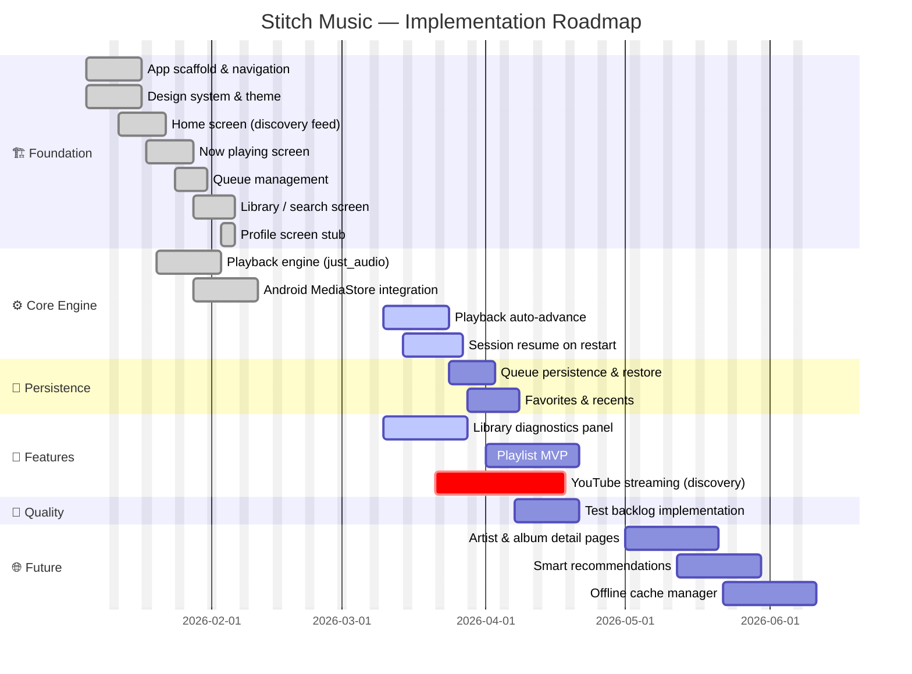

# Product Backlog

## 📊 Project Status Overview

| Phase | Status | Items |
|-------|--------|-------|
| ✅ Foundation | Complete | 7 |
| 🔄 Core Engine | In Progress | 2 of 4 done |
| 🔜 Next Up | Queued | 4 |
| 🔍 Discovery | Under Evaluation | 1 |
| 🌐 Future | Planned | 3 |

---

## 🗺️ Visual Roadmap

---

## ✅ Completed

| Feature | Description |
|---------|-------------|
| App scaffold & navigation | Bottom nav shell, tab routing, page transitions |
| Design system & theme | Material 3, glassmorphism, color tokens, typography |
| Home screen | Discovery feed: hero, recent plays, daily mixes, new releases |
| Now playing screen | Full player with animated album art, controls, progress bar |
| Queue management | Reorderable queue with drag handles and equalizer animation |
| Library / search screen | Filter chips, search bar, context menu, empty state |
| Playback engine | `just_audio` integration, Android MediaStore, permissions |

---

## 🔄 In Progress

| Feature | Agent | Notes |
|---------|-------|-------|
| Playback auto-advance & resume state | Agent A | Auto-advance wired; resume state in progress |
| Library diagnostics panel | Agent C | Permission UX flow in design |

---

## 🔜 Next Up

| Feature | Priority | Dependencies |
|---------|----------|--------------|
| Playlist MVP (create, rename, reorder, play) | 🔴 High | Persistence layer |
| Favorites & recents persistence | 🔴 High | `shared_preferences` |
| Queue persistence with restore | 🔴 High | Playback engine |
| Test backlog implementation | 🟡 Medium | All above features |

---

## 🔍 Discovery

### Stream Audio from YouTube

| Field | Value |
|-------|-------|
| **Status** | 🔍 Under Evaluation |
| **Priority** | 🔴 High |

**Scope:**

1. Evaluate legal and policy-compliant integration paths.
2. Confirm allowed use cases (user-authenticated streaming, licensed APIs).
3. Define architecture for remote stream source adapters.
4. Add UI entry points and playback queue integration.

> ⚠️ **Note:** Implementation must follow platform terms and copyright compliance. Avoid unlicensed extraction workflows.

---

## 🌐 Future

| Feature | Description | Depends On |
|---------|-------------|------------|
| 🎨 Artist & album detail pages | Deep-link pages with full discography | Playlist MVP |
| 🤖 Smart recommendations | Behavior-based local listening suggestions | Favorites & recents |
| 📥 Offline cache manager | Download & cache for permitted stream sources | YouTube discovery |
