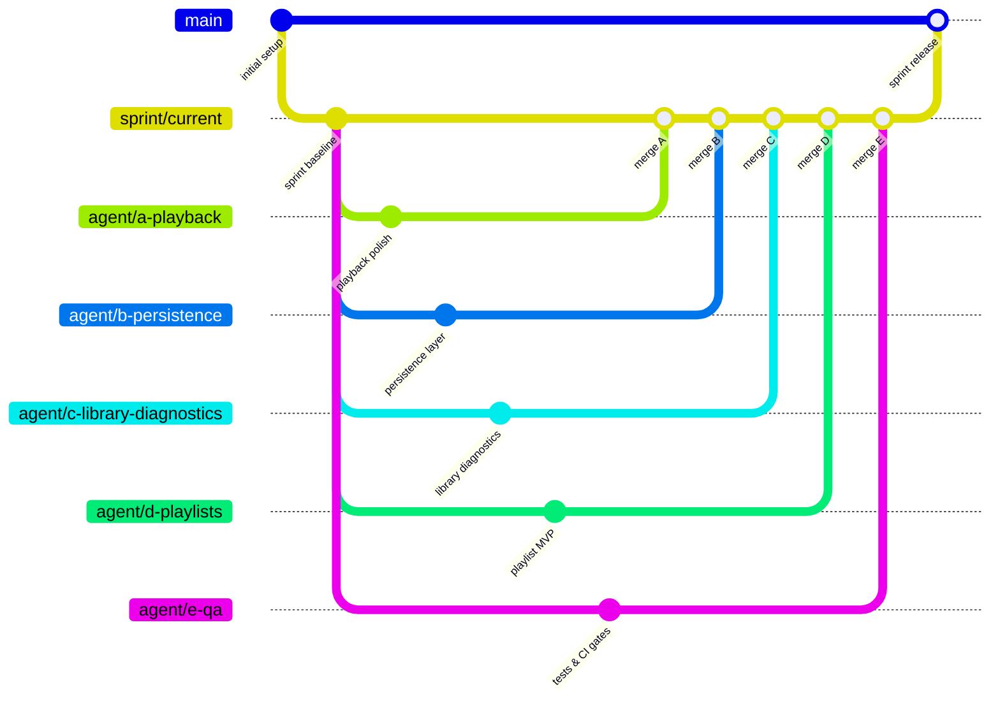
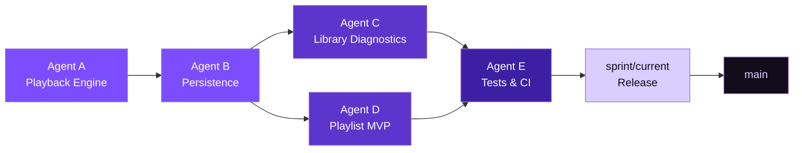

# Parallel Agent Workflow

## Goal
Enable up to 5 concurrent agents without merge conflicts.

---

## 🌿 Branch Layout

---

## 👥 Assignment Matrix

| Agent | Branch | Workstream |
|-------|--------|------------|
| 🎵 Agent A | `agent/a-playback` | Playback polish and runtime stability |
| 💾 Agent B | `agent/b-persistence` | Persistence and resume state |
| 🔍 Agent C | `agent/c-library-diagnostics` | Library diagnostics and permission UX |
| 🎶 Agent D | `agent/d-playlists` | Playlist MVP |
| 🧪 Agent E | `agent/e-qa` | Tests, CI checks, and release gates |

---

## 🔗 Merge Dependency Chain

---

## 📋 Rules

1. One workstream per branch.
2. Rebase daily on `sprint/current`.
3. PR target is `sprint/current`, not `main`.
4. Keep PRs small, under 400 lines when possible.
5. Must pass `flutter analyze` and `flutter test` before review.

---

## 🕐 Daily Sync

1. 10-minute standup
2. Update blockers and ownership
3. Merge order based on dependency chain:
   1. Core services (Agent A)
   2. Persistence (Agent B)
   3. UI integration (Agents C & D)
   4. Tests (Agent E)

---

## ⚡ Fast Conflict Protocol

1. Owner of the conflicting file resolves the merge.
2. If unresolved within 15 minutes, escalate to the lead branch owner.
3. Prefer additive changes and extension methods over deep rewrites.

---

## ✅ Definition of Done

| Criterion | Check |
|-----------|-------|
| CI green on PR | `flutter analyze` + `flutter test` pass |
| Manual Android smoke test complete | Device or emulator verified |
| Acceptance criteria in issue checked | All issue checkboxes ticked |
| No analyzer warnings | Zero `flutter analyze` warnings |
